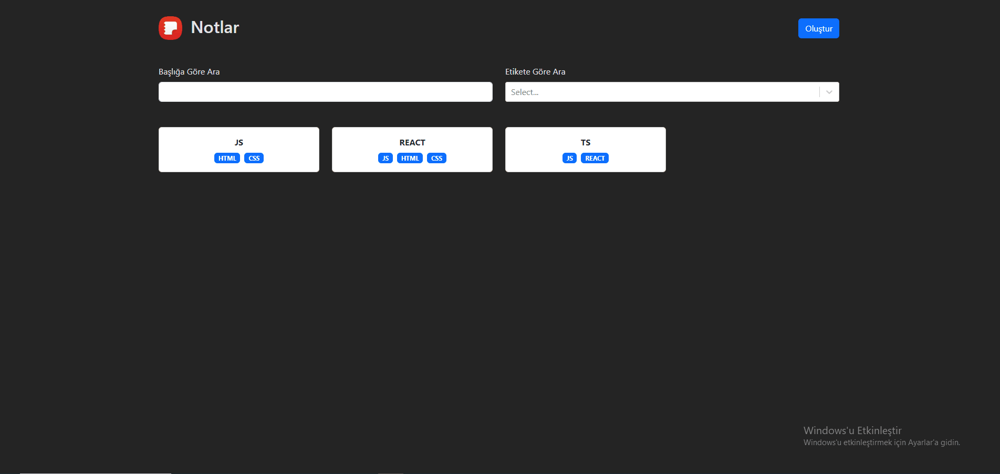

## Notes App Projesi

Bu proje; kullanıcıların başlık, etiket ve içerik girişi yaparak not oluşturmasını amaçlamaktadır. Ayrıca etikete, başlığa göre filtreleme yapılmasına da olanak sağlamaktadır.

## Kullanılan Kütüphaneler

-TypeScript

-react-router-dom

-react-bootstrap

-bootstrap

-react-markdown

-react-select

-uuid

## GIF

